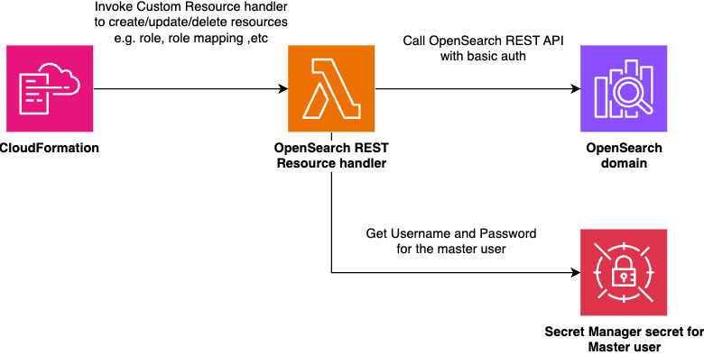

# Custom Resources Library for Amazon OpenSearch Service

An AWS CDK construct library to manage OpenSearch resources via CloudFormation custom resource. This is especially useful if you use fine-grained access control feature on OpenSearch, where you have to create resources such as role or role mapping via OpenSearch REST API.



## Currently supported resources
* [Role](https://opensearch.org/docs/latest/security/access-control/api/#create-role)
* [RoleMapping](https://opensearch.org/docs/latest/security/access-control/api/#create-role-mapping)
* [User](https://opensearch.org/docs/latest/security/access-control/api/#create-role-mapping)

You can manage any other REST resources via our low level API (`ResourceBase` class).

## Usage

Install it via npm:

```sh
npm install opensearch-rest-resources
```

Then you can create OpenSearch resources using [`Domain`](https://docs.aws.amazon.com/cdk/api/v2/docs/aws-cdk-lib.aws_opensearchservice.Domain.html) construct.

```ts
import { IVpc } from 'aws-cdk-lib/aws-ec2';
import { IRole } from 'aws-cdk-lib/aws-iam';
import { Domain } from 'aws-cdk-lib/aws-opensearchservice';
import { OpenSearchRole, OpenSearchRoleMapping } from 'opensearch-rest-resources';

declare const vpc: IVpc;
declare const backendRole: IRole;
declare const domain: Domain;

const role = new OpenSearchRole(this, 'Role1', {
    vpc,
    domain,
    roleName: 'Role1',
    payload: {
        clusterPermissions: ['indices:data/write/bulk'],
        indexPermissions: [
            {
                indexPatterns: ['*'],
                allowedActions: ['read', 'write', 'index', 'create_index'],
            },
        ],
    }
});

const roleMapping = new OpenSearchRoleMapping(this, 'RoleMapping1', {
    vpc,
    domain,
    roleName: 'Role1',
    payload: {
        backendRoles: [backendRole.roleArn],
    },
    removalPolicy: RemovalPolicy.RETAIN,
});
roleMapping.node.addDependency(role);
```

## Limitation
Currently this library assumes your OpenSearch domain is configured such that:

* [Fine-grained access control](https://docs.aws.amazon.com/opensearch-service/latest/developerguide/fgac.html) is enabled
* Use the [`Domain`](https://docs.aws.amazon.com/cdk/api/v2/docs/aws-cdk-lib.aws_opensearchservice.Domain.html) L2 construct
* The master is authenticated with username and password, and the credential is stored in Secret Manager
* [Domain access policy](https://docs.aws.amazon.com/opensearch-service/latest/developerguide/fgac.html#fgac-recommendations) is configured to allow access from the master user

```json
{
  "Version": "2012-10-17",
  "Statement": [
    {
      "Effect": "Allow",
      "Principal": {
        "AWS": "*"
      },
      "Action": "es:ESHttp*",
      "Resource": "domain-arn/*"
    }
  ]
}
```

Most of the above follow the current [operational best practices](https://docs.aws.amazon.com/opensearch-service/latest/developerguide/bp.html) of Amazon OpenSearch Service. If you want other configuration supported, please submit [an issue](https://github.com/tmokmss/opensearch-rest-resources/issues).
